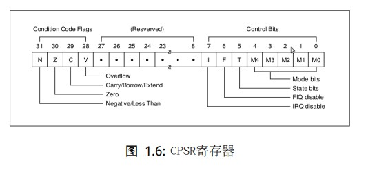

arm7 100Mhz

arm9: 200mhz1400mhz **mmu**: 物理地址和虚拟地址转换  第一代智能手机诺基亚

arm11:500mhz-700mhz 第二代智能手机 苹果 平板电脑

### arm 处理器的七中模式

用户模式（usr）:ARM 处理器正常程序执行状态

快速中断模式（fiq）:用于高速数据传输或通道处理

外部中断模式（irq）:用于通用的中断处理

管理模式（svc）supervisor :操作系统使用的保护模式

数据访问终止模式（abt）:当数据或指令预取终止时进入该模式，可用户虚拟存储系统

系统模式(sys) 运行具有特权的操作系统任务

未定义指令中止模式：运行具有特权操作系统任务。

**除了用户模式外，其他模式均为 “特权”模式，在特权模式下，处理器可以任意访问受保护的系统资源。**

**同一时刻cpu 只能工作在一种模式下**。

 每个寄存器大小都是固定的：32 位

未分组寄存器：r0 - r7       				存放一些临时变量

分组寄存器：r8-r14                                         r8-r12 也是存放一些临时变量。

程序计数器 ： r15(PC)  PC指向哪个地址，cpu 就到那个地址取指令执行。r15 保存的是谁，预取器就会向内存中 的某个地址去取。

当前程序状态寄存器：CPSR 保存程序运行的状态。C: current P : Program S:State ：R：Register

前0-4位：当前cpu 在什么模式。

第5位：T 是arm 指令模式（32位汇编），还是Thumb指令模式（16位汇编 把arm 当单片机用时，采用这种模式）。 

 处理器可以随意切换这两种状态。

arm 的性能更高。比如打印hello world 。

thumb 更节省空间。（智能玩具什么的。节省空间）

置0arm 模式，置1 thumb 模式。决定每次cpu 取指令的位宽。

R13/SP：栈指针寄存器，记录栈顶地址。

R14/LR： 链接返回寄存器，保存程序的返回地址，如函数调用返回。 

第6 位： riq 快速中断总开关

第7位：  irq普通中断

第8-27 位： 保留

NZCV 非常重要。

溢出：两个数相加，如果最高位的进位和次高位的进位不同，则产生溢出。

